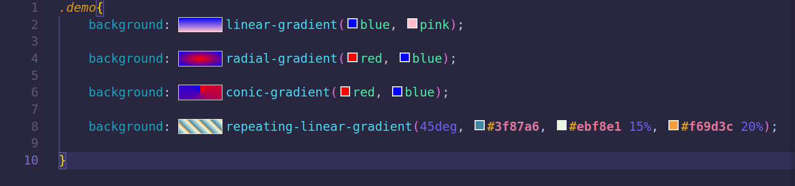
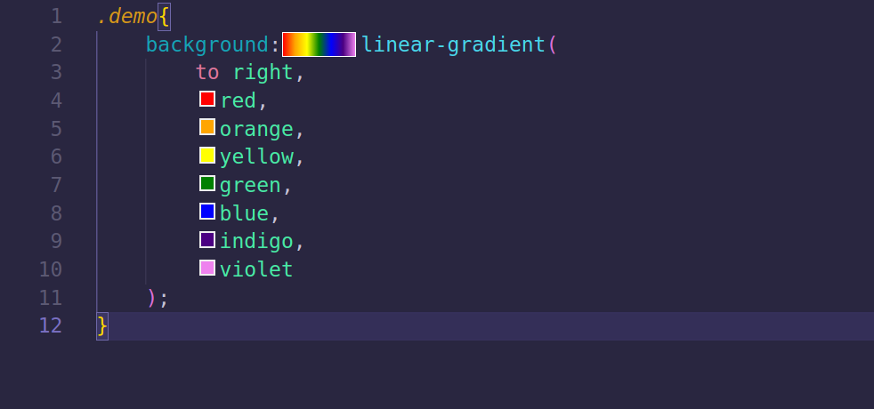
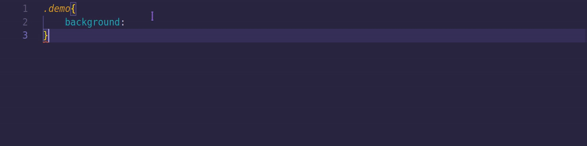
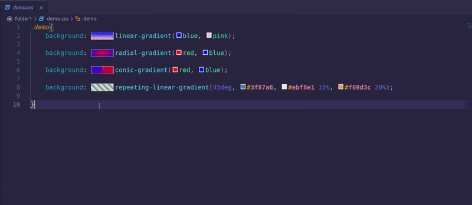
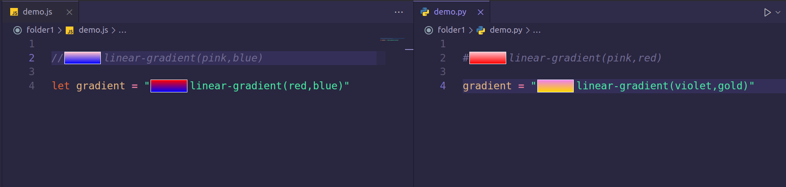

# Mini Gradient Preview 🌈
Mini Gradient Preview allows you to visualize your css gradients in the editor in the form of mini previews next to the gradient declaration

## Features

* Works on `linear-gradient`,`radial-gradient`,`conical-gradient`,`repeating-linear-gradient`.

* Works on multi-line declarations.

* Real-time changes.

* Show or Hide previews in your workspace using `Show Gradient Previews` and `Hide Gradient Previews` commands.

* Works on all types of files that have css gradient declarations

* Only self contained CSS gradients are supported (no variables).

Icon provided by [Murphy](https://www.linkedin.com/in/murphycaxton/)
## Release Notes

### 1.0.0

Initial release of mini gradient preview

